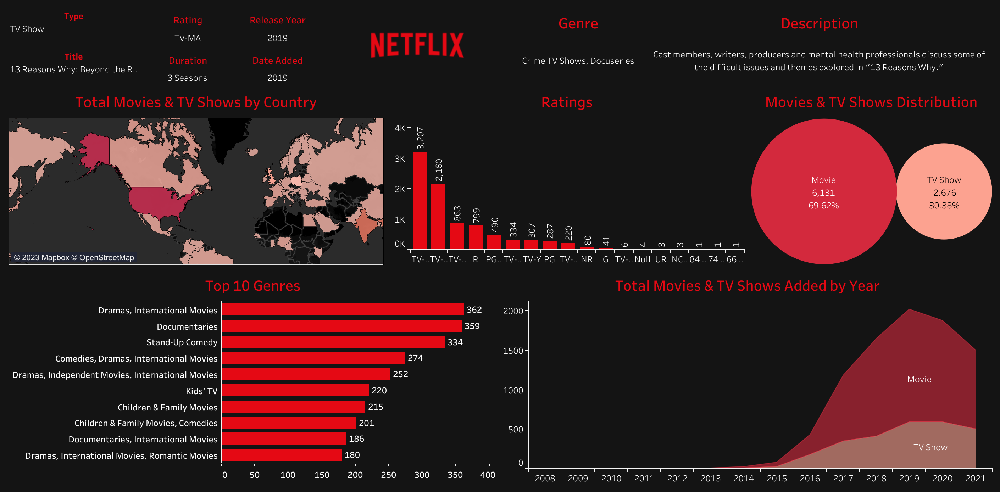

# Hello World 

I'm Ahmed AbuBakr, A Data Scientist and an Aerospace Engineer. 

## About Me

- 📖 Education: Aerospace Technology (BEng) Coventry University
- 👀 Currently a Data Scientist at Apziva
- 🌱 I’m currently learning Artificial Intelligence
- 💞️ I’m looking to collaborate on any interesting projects
- 📫 How to reach me ahmedabubakr92@gmail.com

# Projects

I'm a Data Analyst/Scientist with a solid background in harnessing the power of data to drive decision-making and innovation. With a profound understanding of statistical analysis, data mining, and machine learning techniques, my work merges the gap between technology and strategic business insights.

I believe that seeing is believing. That’s why I've prepared a selection of projects I've worked on to showcase my skill set and expertise. Whether you’re interested in Machine Learning, Predictive Modelling, A/B Testing, Customer Segmentation, or Time Series Analysis, you will find something that resonates with your interests.

Here are some examples of my work:

## [Project 1: IT Educational Institute Project Overview](https://github.com/ahmedabubakr92/IT-Educational-Institute)

The objective of the project is to show the required skills for each job in the IT field. Started by initiating a git repository with a good structure using cookiecutter. Used the StackOverflow Developer Survey of 2022 to create a model that helps the institute recommend and advise learners on which specific skills are needed for which job type. Loaded and cleaned the text data provided, extracting similarities through clustering algorithms using TSNE. Afterward, applied a baseline model (Logistic Regression) and compared it to a Random Forest with PCA using MLFlow.
  
## [Project 2: Predictive Maintenance Project Overview](https://github.com/ahmedabubakr92/Predictive-Maintenance)

The objective of the project is to provide a model that is capable of classifying if there's a fault in a device and afterward classifying the category of the failure that has occurred. I started by explaining what is maintenance and its types and then explored the data to gain insights. Created features that'll result in better machine learning models and added synthetic data using SMOTETomek to balance the dataset. Implemented pipelines that preprocess numerical and categorical data. Then I applied Multi-Class & Multi-Label classifications models. For all the created models, different evaluation metrics were applied such as Accuracy Score, F1 Score, Confusion Matrix and Precision Recall Curves.

## [Project 3: Netflix Dashboard Project Overview](https://github.com/ahmedabubakr92/Netflix-Dashboard)

The objective of the project was to explore the Netflix platform regarding Movies & TV Shows. I wanted to know the number of Movies & TV Shows on the platform, the number of movies produced by different countries by year, and which ratings are the most prevalent, whether it be a Movie or a TV Show, to determine if the platform as a whole is appropriate. 

- __Term Deposit Marketing__: https://github.com/ahmedabubakr92/Term-Deposit-Marketing
- __Potential Talents__: https://github.com/ahmedabubakr92/Potential-Talents
- __Happy Customers__: https://github.com/ahmedabubakr92/Happy-Customers
- __MonReader__: https://github.com/ahmedabubakr92/MonReader
- __Value Investor__: https://github.com/ahmedabubakr92/Value-Investor

<!---
ahmedabubakr92/ahmedabubakr92 is a ✨ special ✨ repository because its `README.md` (this file) appears on your GitHub profile.
You can click the Preview link to take a look at your changes.
--->
